<h1 align="center">
 Filtro Detector de Borda
</h1>

<h4 align="center">
Projeto desenvolvido para a disciplina de MI - Sistemas Digitais (2025.1) na Universidade Estadual de Feira de Santana.
</h4>

<h2 id="sumario">Sumário</h2>
<ul>
  <li><a href="#equipe"><b>Equipe de Desenvolvimento</b></a></li>
  <li><a href="#problema"><b>Problema</b></a></li>
  <li><a href="#requisitos"><b>Requisitos</b></a></li>
  <li><a href="#recursos"><b>Recursos Utilizados</b></a></li>
  <li><a href="#fundamentacao"><b>Fundamentação Teórica</b></a></li>
  <li><a href="#desenvolvimento"><b>Desenvolvimento</b></a></li>
  <li><a href="#testes"><b>Testes</b></a></li>
  <li><a href="#execucao"><b>Como Executar</b></a></li>
  <li><a href="#conclusao"><b>Conclusão</b></a></li>
  <li><a href="#referencias"><b>Referências</b></a></li>
</ul> 

<h2 id="equipe">Equipe de Desenvolvimento</h2>
<ul>
  <li><a href="https://github.com/Giu-11" target="_blank">Giulia Aguiar Loula</a></li>
  <li><a href="https://github.com/Mizogamii" target="_blank">Sayumi Mizogami Santana</a></li>
  <li><a href="https://github.com/tamillycosta" target="_blank">Tamilly Costa Cerqueira</a></li>
</ul>

<h2 id="problema">Problema: </h2>

Desenvolver um programa em linguagem C que aplique filtros de detecção de bordas em uma imagem digital, utilizando a biblioteca em Assembly previamente desenvolvida em conjunto com o coprocessador de operações matriciais implementado na FPGA. O sistema deve ser capaz de realizar o pré-processamento da imagem (conversão para escala de cinza) e aplicar diferentes operadores de detecção de bordas (Sobel, Prewitt, Roberts e Laplaciano). A solução deverá operar com imagens de 320x240 pixels, processadas com 8 bits por pixel.

---
<h2 id="requisitos">Requisitos</h2>

<ul>
  <li>O código deverá ser desenvolvido em linguagem de programação C;</li>
  <li>A aplicação deverá realizar a leitura de uma imagem com resolução de 320x240 pixels;</li>
  <li>A imagem deverá ser convertida para escala de cinza, utilizando representação de 8 bits por pixel;</li>
  <li>Após o pré-processamento, o programa deverá aplicar os seguintes filtros de detecção de borda:
    <ul>
      <li>Sobel (máscara 3x3);</li>
      <li>Sobel expandido (máscara 5x5);</li>
      <li>Prewitt (máscara 3x3);</li>
      <li>Roberts (máscara 2x2);</li>
      <li>Laplaciano (máscara 5x5).</li>
    </ul>
</li>
  </li>
  
</ul>

---
<h2 id="recursos">Recursos utilizados: </h2>

- 🧠 Quartus Prime Lite 23.1  
- 🔌 Kit de desenvolvimento DE1-SoC  
- 📝 Visual Studio Code  
- 🌐 Git e GitHub

---
<h2 id="fundamentacao">1. Fundamentação Teórica: </h2>

  <h3>Detectores de bordas</h3>  
    
Detectores de bordas são ferramentas de processamento de imagem locais utilizadas para identificar pixels que representam bordas, ou seja, regiões onde ocorrem mudanças abruptas de intensidade na imagem. A detecção de bordas baseia-se em propriedades de derivadas, principalmente de primeira e segunda ordem.

    
A derivada de primeira ordem é eficaz na detecção de variações graduais na intensidade da imagem, geralmente resultando em bordas mais espessas. Já a derivada de segunda ordem é mais sensível a mudanças abruptas, sendo utilizada para realçar detalhes finos, como linhas delgadas, pontos isolados e até mesmo ruídos.

Além disso, o sinal da segunda derivada pode fornecer informações sobre a direção da transição de intensidade (de claro para escuro ou de escuro para claro), o que pode ser explorado para uma detecção mais precisa das bordas.

  
  <h3>Convolução</h3>
    
A convolução é uma operação matemática que consiste no somatório do produto entre duas funções ao longo do deslocamento entre elas. No processamento de imagens, essa operação é realizada entre a matriz da imagem e uma matriz menor chamada de máscara ou kernel, que atua como um filtro. O objetivo da convolução é extrair informações relevantes da imagem, como bordas, texturas e contrastes, ou aplicar efeitos como suavização e remoção de ruídos.

    
Para aplicar a convolução, a máscara vai se deslocando sobre a imagem, multiplicando seus valores pelos valores dos pixels correspondentes. Depois disso, os resultados são somados, gerando um valor que compõe um pixel da imagem de saída. Esse processo é repetido para todas as posições válidas da imagem, formando assim uma nova matriz com as características realçadas.
Durante esse deslocamento, utiliza-se o stride, que define quantos pixels a máscara avança a cada passo. Já o padding é usado para adicionar uma borda artificial em volta da imagem original, evitando que informações das extremidades sejam perdidas durante a aplicação da convolução.

    
A partir desses princípios, foram desenvolvidos diversos filtros para o realce de bordas nas imagens. Os mais conhecidos são os filtros de Sobel, Prewitt, Roberts e Laplaciano. Cada um desses filtros possui sua própria matriz, que destaca as mudanças de intensidade em direções específicas.

  <h3>Sobel</h3>
  
O filtro de Sobel é utilizado para a detecção de bordas em imagens digitais, fornecendo tanto a direção (horizontal ou vertical) quanto a taxa de variação da intensidade luminosa nessa direção. Ele funciona por meio da aproximação do gradiente da imagem, utilizando derivadas de primeira ordem.
Para isso, o filtro aplica a convolução da imagem com duas máscaras convolucionais 3x3: uma para detectar variações na direção horizontal (Gx) e outra na direção vertical (Gy). As máscaras utilizadas são:

| Gx (máscara horizontal) | Gy (máscara vertical) |
|-------------------------|-----------------------|
| 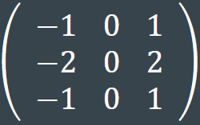 | 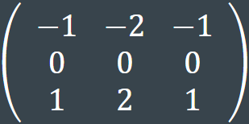 |

As convoluções da imagem com essas máscaras resultam em duas imagens intermediárias: Gx (variação horizontal) e Gy (variação vertical). A partir delas, calcula-se a magnitude do gradiente, que representa a intensidade da borda no ponto analisado.

Para o cálculo do gradiente é utilizada a fórmula:

$$
G = \sqrt{G_x^2 + G_y^2}
$$

Onde:
- $G_x$ = componente horizontal do gradiente
- $G_y$ = componente vertical do gradiente

Após a aplicação ele resulta uma nova imagem com bordas mais destacadas, que auxiliam na análise visual e na interpretação de dados.

Existe também uma variação do Sobel utilizando máscaras 5×5, que oferece maior precisão na detecção de bordas e uma suavização mais pronunciada, sendo especialmente útil em imagens de alta resolução, onde maior precisão e suavização são desejadas. Segue abaixo as máscaras do sobel 5x5: 

| Gx (máscara horizontal) | Gy (máscara vertical) |
|-------------------------|-----------------------|
| 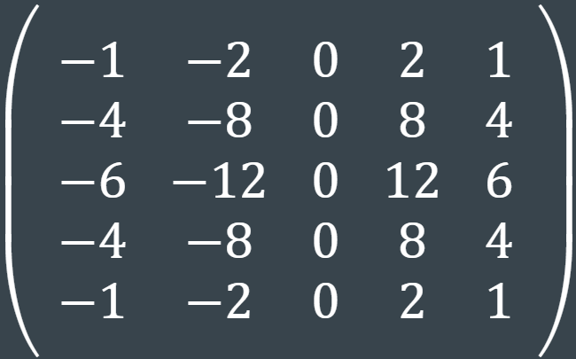 | 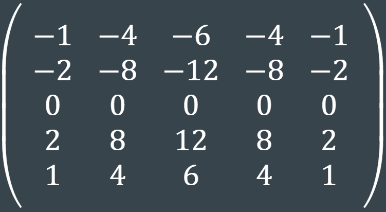 |

Essas máscaras ampliadas são indicadas quando se deseja um balanceamento melhor entre detalhamento da borda e redução de ruído.

<h3>Prewitt</h3>

Assim como o filtro de Sobel, o filtro de Prewitt também utiliza máscaras nas direções horizontal e vertical para detecção de bordas. No entanto, ele é mais adequado para imagens simples e com pouco ruído, pois não oferece tanta precisão na detecção de bordas. Por ser computacionalmente mais simples, o filtro de Prewitt tende a ser mais rápido que outros filtros mais sofisticados. As máscaras utilizadas são: 

| Gx (máscara horizontal) | Gy (máscara vertical) |
|-------------------------|-----------------------|
| 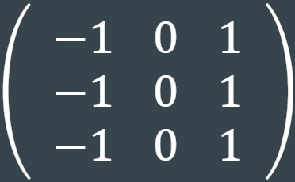 | 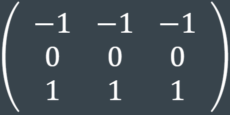 |

<h3>Roberts</h3>

O filtro de Roberts é um operador de detecção de bordas baseado no cálculo de gradientes diagonais. Ele utiliza máscaras convolucionais 2×2, o que o torna extremamente leve e eficiente em termos computacionais. No entanto, essa simplicidade o torna mais sensível a ruídos e menos preciso na detecção de bordas suaves.

A detecção é feita aplicando duas máscaras, que estimam o gradiente nas diagonais principais da imagem. A magnitude do gradiente é calculada com a mesma fórmula utilizada nos demais operadores.

As máscaras utilizadas são: 

| Diagonal principal | Diagonal secundária |
|-------------------------|-----------------------|
| 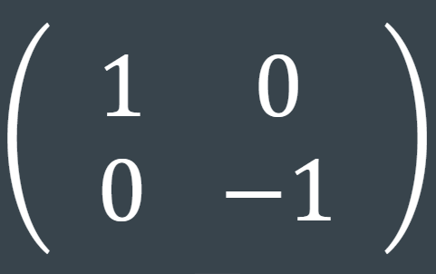 | 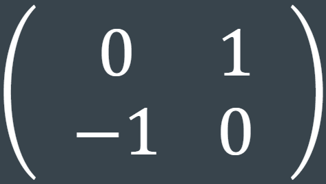 |

<h3>Laplaciano</h3>

O filtro laplaciano é utilizada para a destacar áreas de mudança rápida de intensidade, que geralmente estão associadas às bordas de uma imagem. Diferentemente dos outros filtros como sobel, roberts e prewitt, o filtro laplaciano utiliza a segunda derivada da intensidade da imagem.

A segunda derivada da intensidade da imagem é representada por: 

$$
\nabla^2 I(x, y) = \frac{\partial^2 I}{\partial x^2} + \frac{\partial^2 I}{\partial y^2}
$$

Onde:
- $\nabla^2 I(x, y)$ é o Laplaciano da imagem.
- $\frac{\partial^2 I}{\partial x^2}$ é a segunda derivada na direção $x$.
- $\frac{\partial^2 I}{\partial y^2}$ é a segunda derivada na direção $y$.

Embora o filtro laplaciano seja sensível a mudanças de intensidade em todas as direções, ele também é altamente sensível ao ruído, o que pode limitar sua aplicação direta em imagens reais.

A máscara utilizada é: 

  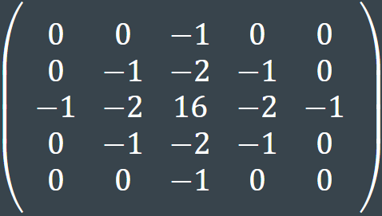

---
<h2 id="desenvolvimento">2. Desenvolvimento: </h2>

  
   

  
Nesse projeto, foi escolhido o formato bitmap (.bmp) para as imagens usadas. Por serem um dos mais simples, representando os valores de cada um dos valores de cor de cada pixel da imagem  como uma sequência de 8 bits. Além disso, esse formato de imagem geralmente não tem compressão, facilitando a modificação de valores de cada pixel da imagem individualmente. Com seu único ponto negativo sendo o tamanho grande dos arquivos, sendo isso resultado direto das vantagens citadas.

  
Para o funcionamento do projeto, foi criada uma série de funções em C dividindo as etapas do processo necessário para aplicar os filtros detectores de borda na imagem. Sendo uma responsável por ler o arquivo informado a ela e aplicar o filtro de escala de cinza, outra responsável por salvar a imagem em um arquivo separado do original e uma para cada um dos filtros solicitados. Além disso, uma última função foi utilizada para simular as operações feitas pelo coprocessador, possibilitando que testes fossem feitos sem o uso desse.

  
Na leitura dos arquivos, não foi usada nenhuma biblioteca dedicada à leitura de arquivos de imagem, sendo os dados lidos e escritos com as funções fopen, fwrite e fread. Assim, os arquivos são lidos como arquivos binários, ou seja, como uma sequência de bits, com dados como, o tipo do arquivo, a altura, largura e profundidade da imagem lidos diretamente do cabeçalho do arquivo. Para facilitar o acesso e armazenamento desses dados, uma struct foi criada para armazenar a imagem por completo, cabeçalho e os pixels, além de uma série de dados que serão necessários durante a execução, como altura, profundidade e tamanho do arquivo. Além de ler e organizar os dados do arquivo, antes que os filtros possam ser aplicados, a imagem é colocada em escala de cinza, tornando o valor de verde, vermelho e azul de cada pixel na média desses valores para tal pixel. Dessa forma, permitindo que menos contas sejam feitas nos filtros, sendo somente uma para cada pixel, em vez de 3, que seria o caso com valores diferentes para cada cor.

  
Para a aplicação dos filtros, foi criada uma função separada para cada, mesmo todas tendo um funcionamento similar, tendo somente mascaras, tamanho de máscaras ou para laplace, uma quantidade diferente, permitindo que seja usado o mesmo código de base para todas, com leves mudanças. Nessa lógica base, a imagem é percorrida, acessando os seus valores, organizados em um único array com todos os pixels, em dois laços, um percorrendo sua altura e outro sua largura, e acessando a posição baseada na linha atual, o tamanho em bytes de uma linha, a coluna atual, e o tamanho de um pixel, todos valores calculados ou lidos do cabeçalho da imagem, sem especificações predefinidas. Assim, para cada pixel, é montada uma matriz temporária com esse pixel e seus vizinhos, conforme o tamanho da máscara do filtro, com, por exemplo, o filtro de sobel 3x3, montando uma matriz com o pixel e seus 8 vizinhos mais próximos.

  
Em seguida, a(s) máscara(s) e essa matriz temporária para o coprocessador, usando a biblioteca criada anteriormente, que deve realizar a convolução, sendo esse processo realizado duas vezes nos filtros que possuem duas mascaras, enviando uma de cada vez, contudo com o mesmo pixel da imagem. Em seguida essa multiplicação, os valores dessa matriz são somados, caso hajam duas mascaras no filtro, é frita a raiz quadrada da soma dos quadrados do resultado de cada soma, caso seja somente uma, é feito o modulo desse valor. Sendo o valor final, o novo valor do pixel atual, usado para seus valores de vermelho, verde e azul.

  
Contudo, devido ao tamanho limitado dos valores usados no coprocessador números poderia ser mal interpretados pelo coprocessador, já que as operações precisam do uso de sinal e a mesmo sequencia d bits que sem sinal é 255, pode ser -1 se interpretado como um número com sinal, resultando em valores inesperados. Para lidar com esse problema, os valores são divididos por 2 anetes de serem enviados e multiplicados por 2 ao retornarem, podendo perder um puco de detalhes, mas evitando esse erro de interpretação nos valores.

  
Após o filtro ser aplicado a imagem, deve ser chamada a função de escrita. Nessa função, é informado em que arquivo essa imagem deve ser salva, além da imagem em si, criando o arquivo destino caso esse não exista. Escrevendo o cabeçalho não modificado da imagem original e os pixels, liberando os espaços alocados para esses dados.

  
Com intuito de facilitar o teste dos filtros foram adicionadas três imagens, ‘1.bmp’, ‘2.bmp’ e ‘3.bmp’, e um menu. Assim, ao iniciar o código, o usuário pode selecionar qual filtro deseja aplicar a que imagem, com o menu acessando a imagem e aplicando o filtro escolhido, salvando cada combinação filtro imagem com um nome diferente.

  

---
<h2 id="testes">3. Testes: </h2>

  As imagens utilizadas para os testes foram: 

<table>
  <tr>
    <td>
      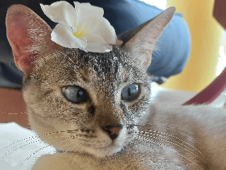
    </td>
    <td>
      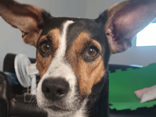
    </td>
    <td>
      
    </td>
    <td>
      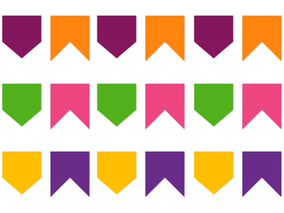
    </td>
  </tr>
</table>

<h3>Sobel 3x3</h3>

<table>
  <tr>
    <td>
      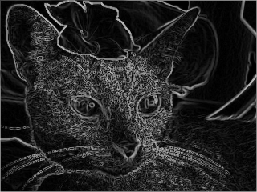
    </td>
    <td>
      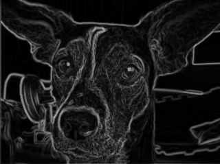
    </td>
    <td>
      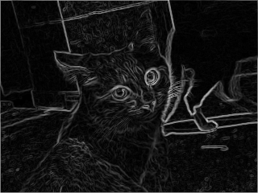
    </td>
    <td>
      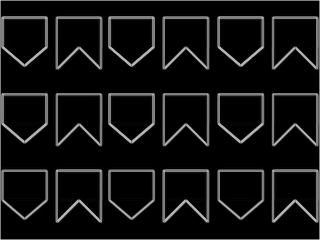
    </td>
  </tr>
</table>

<h3>Sobel 5x5</h3>

<table>
  <tr>
    <td>
      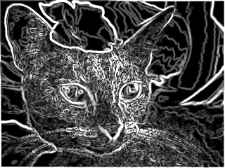
    </td>
    <td>
      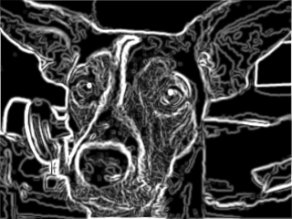
    </td>
    <td>
      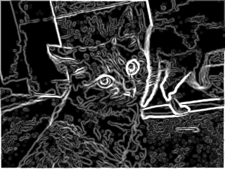
    </td>
    <td>
      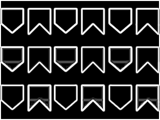
    </td>
  </tr>
</table>

<h3>Prewitt</h3>

<table>
  <tr>
    <td>
      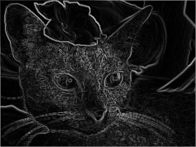
    </td>
    <td>
      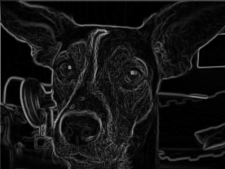
    </td>
    <td>
      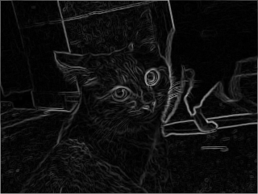
    </td>
    <td>
      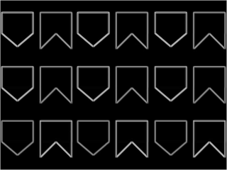
    </td>
  </tr>
</table>

<h3>Roberts</h3>

<table>
  <tr>
    <td>
      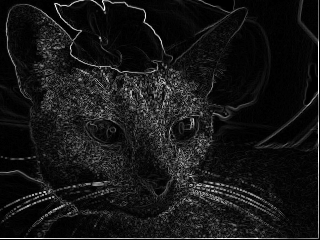
    </td>
    <td>
      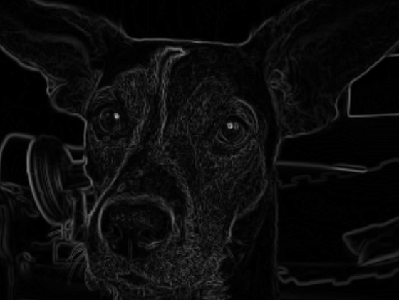
    </td>
    <td>
      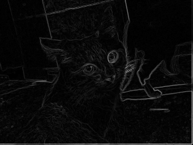
    </td>
    <td>
      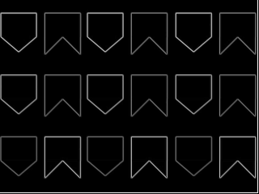
    </td>
  </tr>
</table>

<h3>Laplaciano</h3>

<table>
  <tr>
    <td>
      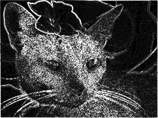
    </td>
    <td>
      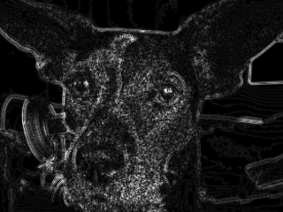
    </td>
    <td>
      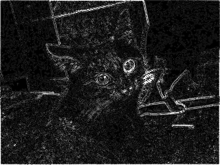
    </td>
    <td>
      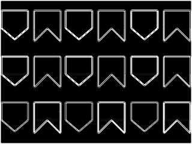
    </td>
  </tr>
</table>

---

<h2 id="execucao">4. Como Executar</h2>

<h3>1️⃣ Clone o repositório</h3>

<pre><code>git clone https://github.com/tamillycosta/Mi-Sistemas-Digitais-.git
</code></pre>

<h3>2️⃣ Executar o Coprocessador no Quartus Prime</h3>
<ol>
  <li>Abra o Quartus Prime.</li>
  <li>No menu, vá em <strong>File &gt; Open Project</strong> e selecione o arquivo <code>.qpf</code> do projeto.</li>
  <li>Compile o projeto clicando em <strong>Compile</strong> no menu principal.</li>
  <li>Carregue o projeto na FPGA:
    <ul>
      <li>Vá em <strong>Tools &gt; Programmer</strong></li>
      <li>Selecione o arquivo <code>.sof</code> compilado.</li>
      <li>Envie para a placa <strong>DE1-SoC</strong> conectada via <strong>USB-Blaster</strong>.</li>
    </ul>
  </li>
</ol>

<h3>3️⃣ Executar a Biblioteca Assembly no HPS</h3>
<ol>
  <li>Conecte-se ao HPS via SSH.</li>
  <li>Adicione os arquivos da pasta <code>Mi-Sistemas-Digitais-</code> ao HPS.</li>
  <li>Compile o projeto manualmente usando o seguinte comando:</li>
</ol>

<pre><code>gcc -Wall -Wextra -o programa main.c mulLib.c libAssembly.s -lrt -lm
</code></pre>

<ol start="4">
  <li>Execute o programa:</li>
</ol>

<pre><code>sudo ./programa
</code></pre>

---
<h2 id="conclusao">5. Conclusão:</h2>

  
O projeto de implementação de filtros de detecção de bordas com uso de coprocessador em FPGA demonstrou-se eficaz tanto em nível funcional quanto educacional. A proposta foi integralmente atendida: as imagens foram lidas, processadas e submetidas aos filtros Sobel (3x3 e 5x5), Prewitt, Roberts e Laplaciano, gerando resultados visivelmente compatíveis com o esperado para cada operador.

  
A integração entre software (linguagem C e Assembly) e hardware (coprocessador matricial na DE1-SoC) permitiu o desenvolvimento de uma solução robusta. O uso da linguagem C sem bibliotecas externas para manipulação de imagens bitmap proporcionou maior controle sobre os dados, reforçando o entendimento sobre manipulação binária e estruturas de arquivos.

  
Além disso, a comparação entre os diferentes filtros aplicados evidenciou suas particularidades: o filtro de Sobel mostrou-se eficiente na detecção de bordas bem definidas, com a versão 5x5 oferecendo maior suavização e precisão; o Prewitt, por ser computacionalmente mais simples, teve desempenho satisfatório em imagens com menos ruído; o Roberts destacou-se por sua leveza, embora mais sensível a imperfeições; e o Laplaciano, por sua vez, evidenciou bordas com maior sensibilidade, porém com maior suscetibilidade a ruídos.

  
Em suma, o projeto reforçou conhecimentos essenciais sobre processamento de imagens, programação de baixo nível e integração hardware/software, consolidando a aplicação prática dos conceitos abordados na disciplina de Sistemas Digitais.

---
<h2 id="referencias">6. Referências Bibliográficas</h2>

  <ul>
    <li>GONZALEZ, Rafael C.; WOODS, Richard E. Digital image processing. 4. ed. global. Harlow: Pearson Education Limited, 2018.</li>
    <li>HIPR2. Roberts cross edge detector. University of Edinburgh, [s.d.]. Disponível em: https://homepages.inf.ed.ac.uk/rbf/HIPR2/roberts.htm. Acesso em: 5 jun. 2025.</li>
    <li>HIPR2. Sobel edge detector. University of Edinburgh, [s.d.]. Disponível em: https://homepages.inf.ed.ac.uk/rbf/HIPR2/sobel.htm. Acesso em: 4 jun. 2025.</li>
    <li>MARQUES, Oge. Processamento digital de imagens. [s.l.], 1999. Disponível em: https://www.ogemarques.com/wp-content/uploads/2014/11/pdi99.pdf. Acesso em: 3 jun. 2025.</li>
    <li>PINHO, Mário. Introdução ao processamento de imagens. Pontifícia Universidade Católica do Rio Grande do Sul (PUC-RS), [s.d.]. Disponível em: https://www.inf.pucrs.br/pinho/CGII/PDFs/IntroducaoProcImg.pptx.pdf. Acesso em: 3 jun. 2025.</li>
    <li>ROBOFLOW. Edge detection in computer vision: a comprehensive guide. Roboflow Blog, 2023. Disponível em: https://blog.roboflow.com/edge-detection/. Acesso em: 4 jun. 2025.</li>
    <li>ROBOFLOW. Laplacian edge detection. Roboflow Blog, 2023. Disponível em: https://blog.roboflow.com/edge-detection/#laplacian-edge-detection. Acesso em: 5 jun. 2025.</li>
    <li>VICERI, Rodrigo. Entendendo de vez a convolução: base para processamento de imagens. VICERI, 2021. Disponível em: https://viceri.com.br/insights/entendendo-de-vez-a-convolucao-base-para-processamento-de-imagens/. Acesso em: 3 jun. 2025.</li>
