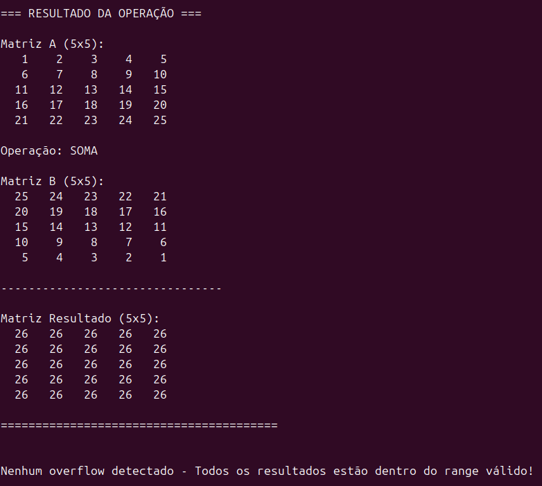
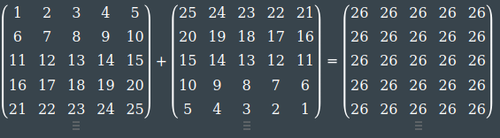
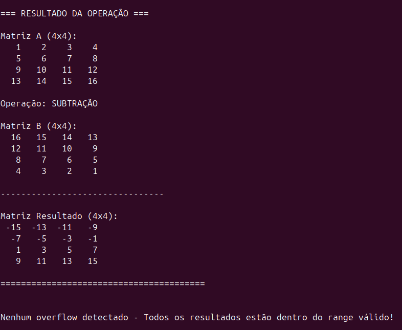
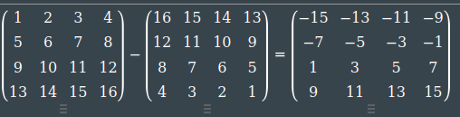
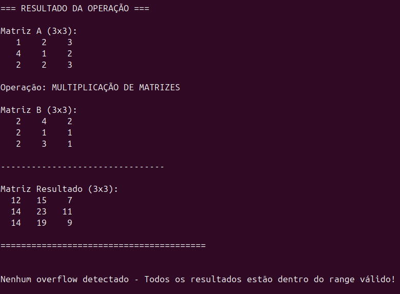
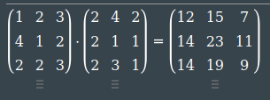
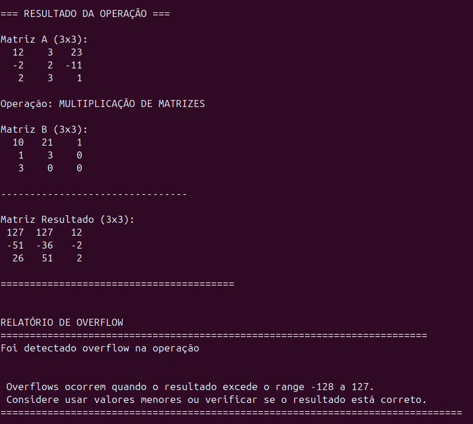
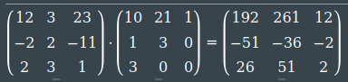
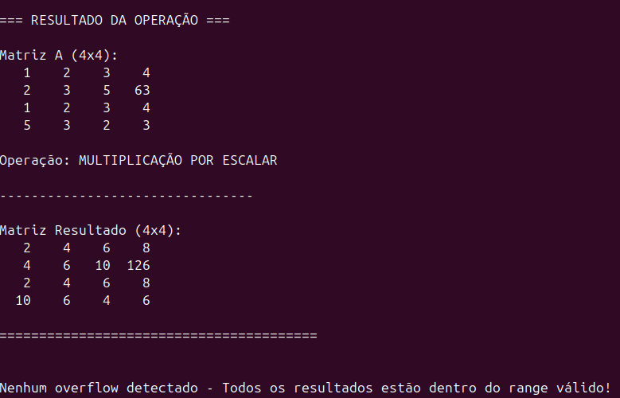
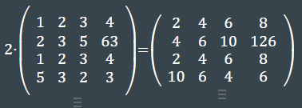

<h1 align="center">
 Biblioteca em Assembly do Coprocessador Aritmético
</h1>

<h4 align="center">
Projeto desenvolvido para a disciplina de MI - Sistemas Digitais (2025.1) na Universidade Estadual de Feira de Santana.
</h4>

<h2 id="sumario">Sumário</h2>
<ul>
  <li><a href="#equipe"><b>Equipe de Desenvolvimento</b></a></li>
  <li><a href="#problema"><b>Problema</b></a></li>
  <li><a href="#requisitos"><b>Requisitos</b></a></li>
  <li><a href="#recursos"><b>Recursos Utilizados</b></a></li>
  <li><a href="#fundamentacao"><b>Fundamentação Teórica</b></a></li>
  <li><a href="#desenvolvimento"><b>Desenvolvimento</b></a></li>
  <li><a href="#testes"><b>Testes</b></a></li>
  <li><a href="#execucao"><b>Como Executar</b></a></li>
  <li><a href="#conclusao"><b>Conclusão</b></a></li>
  <li><a href="#referencias"><b>Referências</b></a></li>
</ul> 

<h2 id="equipe">Equipe de Desenvolvimento</h2>
<ul>
  <li><a href="https://github.com/Giu-11" target="_blank">Giulia Aguiar Loula</a></li>
  <li><a href="https://github.com/Mizogamii" target="_blank">Sayumi Mizogami Santana</a></li>
  <li><a href="https://github.com/tamillycosta" target="_blank">Tamilly Costa Cerqueira</a></li>
</ul>

<h2 id="problema">Problema: </h2>

O projeto tem como objetivo desenvolver uma biblioteca em linguagem Assembly para permitir a utilização, a partir do processador ARM, do coprocessador aritmético desenvolvido no Problema 1. Essa biblioteca facilitará a integração entre software e hardware, possibilitando o uso das operações matriciais aceleradas por hardware em aplicações diversas.

<h2 id="requisitos">Requisitos</h2>
<ul>
  <li>A biblioteca deve ser implementada em linguagem Assembly compatível com a arquitetura ARM da plataforma DE1-SoC;</li>
  <li>Deve conter as funções necessárias para usar as operações matriciais do coprocessador desenvolvido;</li>
  <li>As funções devem permitir a comunicação entre o processador ARM e a FPGA.</li>
</ul>

<h2 id="recursos">Recursos utilizados: </h2>

- 🧠 Quartus Prime Lite 23.1  
- 🔌 Kit de desenvolvimento DE1-SoC  
- 📝 Visual Studio Code  
- 🌐 Git e GitHub

---
<h2 id="fundamentacao">1. Fundamentação Teórica: </h2>

<h3>🛠️ Assembly</h3>

  
Assembly é uma linguagem de programação de baixo nível, sendo uma tentativa de substituir a linguagem de máquina por uma forma mais próxima da linguagem humana, com o objetivo de facilitar o entendimento e a programação. Ela é composta por uma série de instruções compreensíveis pelo programador, os quais são posteriormente convertidas em linguagem de máquina pelo assembler.

  

  Cada instrução em Assembly corresponde diretamente a uma instrução da arquitetura do processador, o que torna essa linguagem extremamente eficiente e precisa para o controle do hardware. No entanto, essa proximidade com o nível de máquina exige que o programador tenha um conhecimento detalhado da arquitetura utilizada, como os registradores disponíveis, os tipos de instruções e os modos de endereçamento.

Assembly é especialmente útil para a otimização de código e a manipulação direta do hardware. Em projetos acadêmicos e profissionais que envolvem FPGAs, microcontroladores ou a construção de processadores, o conhecimento dessa linguagem é de grande importância. 

  
<h3>💾 Registradores</h3>
  

  Os registradores são pequenas unidades de armazenamento de dados integradas diretamente ao processador, responsáveis por guardar temporariamente valores usados nas operações aritméticas e lógicas. Por estarem fisicamente muito próximos da unidade de execução, oferecem altíssima velocidade de acesso, sendo consideravelmente mais rápidos do que qualquer outro tipo de memória. 
  

  

    Enquanto em linguagens de alto nível é possível declarar diversas variáveis armazenadas na memória principal, os registradores são poucos — normalmente somente 32 por CPU. A escassez de registradores exige que o programador ou compilador faça um uso eficiente desses recursos, uma vez que o acesso à memória principal é mais lento. Além disso, o número limitado também está relacionado a princípios de projeto de hardware, como o “menor é mais rápido”, que considera que circuitos menores contribuem para ciclos de clock mais curtos e maior desempenho do processador.
  

  <h3>⚙️ Arquitetura ARM</h3>
  

    ARM (Advanced RISC Machine) é uma família de arquiteturas de processadores baseada no modelo RISC (Reduced Instruction Set Computing), que adota um conjunto de instruções simples e reduzido. Como essas instruções são executadas em poucas etapas, os processadores ARM conseguem realizar tarefas com alta eficiência, baixo consumo de energia e bom desempenho.
  

  

    Apesar da simplicidade das instruções, os processadores ARM oferecem excelente desempenho, o que os torna ideais para uma ampla variedade de aplicações, desde dispositivos móveis e sistemas embarcados até microcontroladores e aplicações industriais. Sua popularidade também se deve à flexibilidade de implementação: a arquitetura pode ser licenciada por fabricantes que a integram a seus próprios projetos, muitas vezes junto a outros elementos como periféricos e unidades de hardware dedicadas.
  

  <h3>🔗 Conexão FPGA-HPS</h3>
  

    A comunicação entre o processador ARM (HPS-Sistema de Processador Rígido) e a FPGA(Arranjo de Portas programáveis em campo) é feita por meio de interfaces dedicadas, como o barramento Lightweight AXI, que permite a troca eficiente de dados entre os dois. Essa conexão funciona com base no conceito de memória compartilhada: cada lado tem acesso direto aos dados da ponte, o que significa que, ao escrever dados de um lado, o outro já pode acessá-los imediatamente. Esse mecanismo é essencial para a integração entre hardware e software na DE1-SoC.
  

---
<h2 id="desenvolvimento">2. Desenvolvimento: </h2>

  <h3>2.1 Mudanças no coprocessador</h3>
  

    No Projeto 1, foi desenvolvido um coprocessador aritmético capaz de realizar cálculos matriciais. A intenção era utilizá-lo também no segundo problema, que consistia na criação de uma biblioteca em Assembly para interface com o coprocessador. No entanto, foram identificadas limitações técnicas na implementação realizada, o que inviabilizou sua utilização na segunda parte do projeto.
  

  

    Dessa forma, para dar continuidade ao desenvolvimento, foi optado a utilização do coprocessador fornecido pelo monitor da disciplina de Sistemas Digitais. O repositório desse coprocessador pode ser acessado <a href="https://github.com/DestinyWolf/CoProcessador_PBL2_SD_2025-1.git">neste link</a>.

  

    Além disso, para atender aos requisitos do projeto, foi necessário implementar o tratamento de overflow por meio de um mecanismo de saturação. Como o coprocessador utiliza números com 8 bits, o maior valor positivo representável é 127 e o menor valor negativo é -128. Assim, quando uma operação produz um resultado maior que 127, o valor é ajustado para 127. Da mesma forma, quando o resultado é menor que -128, ele é ajustado para -128. Essa abordagem evita distorções ou travamentos causados por estouros.
  

  

    Por fim, também foi identificado que o coprocessador utilizado não conseguia realizar a operação de multiplicação escalar com números negativos. Foi necessário implementar uma modificação adicional para permitir esse tipo de operação.
  

  
  

  <h3>2.2 Comunicação HPS - FPGA</h3>
   

     Para o desenvolvimento do sistema, foi necessário estabelecer uma interface de comunicação entre o HPS (Hard Processor System) e o FPGA, permitindo o envio de instruções ao coprocessador implementado na lógica programável. Para isso, foi utilizado o Qsys, uma ferramenta da Intel, integrada ao ambiente Quartus Prime, que permite o projeto de sistemas embarcados baseados em FPGA .
   

  

    O Qsys gera automaticamente a lógica de interconexão entre os componentes do sistema, utilizando o barramento Avalon como protocolo padrão de comunicação. 
  

  

    Por meio dessa ferramenta, foi possível configurar os endereços de memória, definir os tipos de acesso e gerar os arquivos de integração entre o HPS e os periféricos implementados no FPGA. O projeto base foi disponibilizado em uma prática de laboratório da disciplina e posteriormente modificado para atender às exigências do sistema proposto.
  

  

    A partir disto, foram adicionadas  as entradas e saídas programadas (PIO) de acordo com os barramentos do coprocessador:
  

  <table>
    <thead>
      <tr>
        <th>Barramento</th>
        <th>Tipo</th>
        <th>Tamanho</th>
      </tr>
    </thead>
    <tbody>
      <tr>
        <td>Instruction</td>
        <td>Input</td>
        <td>18 bits</td>
      </tr>
      <tr>
        <td>wr</td>
        <td>Input</td>
        <td>1 bit</td>
      </tr>
      <tr>
        <td>Dataout</td>
        <td>Output</td>
        <td>8 bits</td>
      </tr>
      <tr>
        <td>Flags</td>
        <td>Output</td>
        <td>3 bits</td>
      </tr>
    </tbody>
  </table>

  Os barramentos são instanciados no módulo main do coprocessador e linkados com as equivalentes portas do verilog. 

<h3>2.3 Biblioteca Assembly</h3>

  No assembly, foram implementadas 7 funções para a estabelecer o envio das instruções e recebimento dos dados.

<ul>
  <li>Init_hardware:</li>
  

    A função é responsável pela etapa de inicialização do sistema, realizando o mapeamento de memória entre o HPS e o FPGA por meio do AXI Lightweight Bridge.
  

  

    Inicialmente, o arquivo /dev/mem é aberto para permitir o acesso direto à memória física do sistema. Em seguida, é utilizado o <code>mmap()</code> para mapear a região correspondente ao AXI Lightweight Bridge para o espaço de memória virtual do processo, permitindo o acesso direto aos registradores do FPGA via ponteiros.
  

  

    Após o mapeamento, são inicializados os ponteiros que acessam os registradores das interfaces PIO utilizadas na comunicação com o coprocessador: flags, wr, inst e dataOut. Esses ponteiros permitem a escrita e leitura direta dos sinais de controle e dados entre o HPS e o hardware implementado no FPGA.
  

<li>Send_element:</li>
  

    A função tem como objetivo montar e enviar uma instrução do tipo store para o coprocessador. A instrução é codificada em um único inteiro de 32 bits e contém os seguintes campos:
  

  <ul>
    <li>Valor (8 bits): o dado a ser armazenado;</li>
    <li>Linha (i): índice da linha do elemento na matriz;</li>
    <li>Coluna (j): índice da coluna do elemento na matriz;</li>
    <li>Opcode (4 bits): define qual matriz deve receber o dado.</li>
  </ul>
  
  

  Após montar a instrução, a função desativa o sinal de escrita, escreve a instrução no registrador correspondente e aguardar a finalização da operação por meio do sinal de status (*flags);
  

  <li>Execute_operation:</li>
  

    A função é responsável por enviar instruções genéricas ao coprocessador, atuando como um mecanismo auxiliar nas operações principais do sistema. Ela é utilizada para o disparo de comandos de carregamento (load), armazenamento (store) e, principalmente, para o envio de instruções de operações aritméticas sobre matrizes, como adição, subtração e multiplicação.
  

  <li>Mult_escalar:</li>
  

    A função é responsável por montar e enviar uma instrução codificada diretamente ao coprocessador para realizar a operação de multiplicação escalar.
  

  

    Diferente das instruções que operam sobre elementos posicionais (linha, coluna), esta função encapsula o valor escalar diretamente na própria instrução. Isso se deve ao fato de que o opcode destinado à multiplicação escalar já inclui o operando imediato (escalar) dentro de sua codificação, dispensando o uso de registradores auxiliares para envio do dado.
  

  
A instrução gerada possui o seguinte formato:

<table border="1">
  <thead>
    <tr>
      <th>Bits</th>
      <th>Descrição</th>
      <th>Observação</th>
    </tr>
  </thead>
  <tbody>
    <tr>
      <td>[10:3]</td>
      <td>Valor escalar (8 bits)</td>
      <td>Utilizado na multiplicação por escalar</td>
    </tr>
    <tr>
      <td>[2:0]</td>
      <td>Opcode da operação</td>
      <td><code>0b101</code> representa multiplicação escalar</td>
    </tr>
  </tbody>
</table>

  
Após montar a instrução, a função a escreve no registrador de instrução monitorado pelo coprocessador e aguarda a conclusão da operação por meio do sinal de status.

  <li>Register_overflow :</li>
  

     A rotina tem como objetivo registrar ocorrências de estouro (overflow) durante operações matriciais no hardware, armazenando a posição (linha e coluna) e o valor que causou o overflow em vetores de acompanhamento. Para garantir a integridade dos buffers, ela só adiciona novas entradas se o contador de overflows (overflow_count) for menor que 25, evitando assim escrita fora dos limites. 
  

  

    O overflow do sistema é sinalizado todas às vezes que uma operação aritmética resulta em um valor fora do range de <code>-128 a 127</code>, quando isto ocorre o coprocessador sinaliza no endereço do ponteiro para flags que o valor operado será truncado e não terá o valor exato da operação.
  

  <li>Result:</li>

  

    A função tem como objetivo recuperar, a partir do coprocessador, o valor resultante armazenado na posição <strong>[i][j]</strong> de uma matriz processada. 
    Para isso, a função monta uma instrução codificada com os índices da linha (i) e da coluna (j), além de um <em>opcode</em> específico (<code>0b001</code>), 
    que sinaliza ao hardware que se trata de uma operação de leitura. A instrução é escrita diretamente no registrador responsável por transmitir comandos ao coprocessador.
  

  <h3 style="text-align: center; margin-top: 40px;">Formato da Instrução (9 bits)</h3>

  

    <table border="1" cellpadding="10" cellspacing="0" style="border-collapse: collapse; text-align: center;">
      <thead style="background-color: #f2f2f2;">
        <tr>
          <th>Bits</th>
          <th>Campo</th>
          <th>Descrição</th>
          <th>Tamanho (bits)</th>
        </tr>
      </thead>
      <tbody>
        <tr>
          <td>8 : 6</td>
          <td>Índice da linha (i)</td>
          <td>Índice da linha na matriz</td>
          <td>3</td>
        </tr>
        <tr>
          <td>5 : 3</td>
          <td>Índice da coluna (j)</td>
          <td>Índice da coluna na matriz</td>
          <td>3</td>
        </tr>
        <tr>
          <td>2 : 0</td>
          <td>Opcode</td>
          <td>Código da operação (<code>0b001</code> = leitura do resultado)</td>
          <td>3</td>
        </tr>
      </tbody>
    </table>
  

  
<strong>Opcode <code>0b001</code></strong> indica operação de leitura do resultado.

  

    Após o envio da instrução, a função entra em uma etapa de espera ativa, onde monitora o registrador de status até que o coprocessador sinalize a conclusão da operação, 
    indicando que o dado está disponível no registrador de saída. Em seguida, o valor correspondente à posição solicitada é lido diretamente e armazenado.
  

  

    Antes de retornar esse valor, a função verifica se houve um <em>overflow</em> na operação que gerou o dado. 
    Isso é feito por meio da leitura do valor atual de <code>*flags</code>. 
    Se <code>*flags >= 4</code>, um estouro é identificado, e a função registra a ocorrência chamando <code>register_overflow</code>, 
    armazenando a posição e o valor para análise posterior.
  

  

    Por fim, o valor recuperado é retornado, tornando essa função essencial tanto para a obtenção de resultados como para o controle de falhas numéricas no processamento feito pelo coprocessador.
  

<h3>2.4 Menu do Sistema</h3>

A última etapa do desenvolvimento consistiu na implementação da interface de interação com o usuário, responsável pelo envio e recebimento de dados do sistema. Essa interface foi construída por meio de um menu textual, implementado em linguagem C, com foco na simplicidade e na integração direta com a biblioteca desenvolvida em Assembly.

O menu permite ao usuário realizar a entrada de dados, escolher operações a serem realizadas pelo coprocessador, visualizar os resultados processados e identificar possíveis falhas (como overflow). O código conta com funções de leitura de entrada (input), tratamento de erros, e exibição formatada dos resultados.

Além disso, o menu atua como camada de controle, sendo responsável por chamar as rotinas da biblioteca Assembly conforme as opções selecionadas. Dessa forma, a aplicação em C orquestra as operações  de forma estruturada, servindo como ponte entre o usuário e o coprocessador implementado em hardware.

---
<h2 id="testes">3. Testes: </h2>

  Para garantir que as operações estão funcionando corretamente, foram realizados alguns testes práticos.
  Em cada linha da tabela abaixo, é apresentada a operação enviada ao sistema (à esquerda) e o resultado esperado,
  calculado com a ferramenta <a href="https://matrixcalc.org/" target="_blank">Matrix Calculator</a> (à direita).
  Dessa forma, foi possível realizar a comparação e validar se tudo está funcionando conforme o esperado.

<table align="center">
  <!-- Linha 1: Adição -->
  <tr>
    <td align="center">
      
      
<em>Adição</em>

    </td>
    <td align="center">
      
      
<em>Resultado obtido por calculadora de matrizes</em>

    </td>
  </tr>

  <!-- Linha 2: Subtração -->
  <tr>
    <td align="center">
      
      
<em>Subtração</em>

    </td>
    <td align="center">
      
      
<em>Resultado obtido por calculadora de matrizes</em>

    </td>
  </tr>

  <!-- Linha 3: Multiplicação -->
  <tr>
    <td align="center">
      
      
<em>Multiplicação</em>

    </td>
    <td align="center">
      
      
<em>Resultado obtido por calculadora de matrizes</em>

    </td>
  </tr>

  <!-- Linha 4: Multiplicação com overflow -->
  <tr>
    <td align="center">
      
      
<em>Multiplicação com overflow</em>

    </td>
    <td align="center">
      
      
<em>Resultado obtido por calculadora de matrizes</em>

    </td>
  </tr>
  
<!-- Linha 5: Multiplicação escalar -->
  <tr>
    <td align="center">
      
      
<em>Multiplicação escalar</em>

    </td>
    <td align="center">
      
      
<em>Resultado obtido por calculadora de matrizes</em>

    </td>
  </tr>
</table>

---

<h2 id="execucao">4. Como Executar</h2>

<h3>1️⃣ Clone o repositório</h3>

<pre><code>git clone https://github.com/tamillycosta/Mi-Sistemas-Digitais-.git
</code></pre>

<h3>2️⃣ Executar o Coprocessador no Quartus Prime</h3>
<ol>
  <li>Abra o Quartus Prime.</li>
  <li>No menu, vá em <strong>File &gt; Open Project</strong> e selecione o arquivo <code>.qpf</code> do projeto.</li>
  <li>Compile o projeto clicando em <strong>Compile</strong> no menu principal.</li>
  <li>Carregue o projeto na FPGA:
    <ul>
      <li>Vá em <strong>Tools &gt; Programmer</strong></li>
      <li>Selecione o arquivo <code>.sof</code> compilado.</li>
      <li>Envie para a placa <strong>DE1-SoC</strong> conectada via <strong>USB-Blaster</strong>.</li>
    </ul>
  </li>
</ol>

<h3>3️⃣ Executar a Biblioteca Assembly no HPS</h3>
<ol>
  <li>Conecte-se ao HPS via SSH.</li>
  <li>Adicione os arquivos da pasta <code>Mi-Sistemas-Digitais-</code> ao HPS.</li>
  <li>Compile o projeto manualmente usando o seguinte comando:</li>
</ol>

<pre><code>gcc -Wall -Wextra -o programa main.c menu.c libAssembly.s -lrt
</code></pre>

<ol start="4">
  <li>Execute o programa:</li>
</ol>

<pre><code>sudo ./programa
</code></pre>

<h2 id="conclusao">5. Conclusão:</h2>

A partir da implementação de um coprocessador customizado, foi possível explorar o envio de instruções e a manipulação de dados diretamente via memória mapeada, utilizando a ponte AXI-Lightweight entre a HPS e a FPGA, configurada por meio da ferramenta Qsys.

A biblioteca em Assembly desenvolvida permitiu encapsular as instruções de baixo nível, facilitando a comunicação eficiente com o hardware. Já a interface em linguagem C funcionou como uma camada de controle, permitindo ao usuário interagir com o sistema de forma prática, com entrada de dados, execução de operações e exibição dos resultados. O sistema também foi projetado com mecanismos de verificação e registro de overflow, assegurando maior confiabilidade nas operações aritméticas realizadas pelo coprocessador.

Dessa forma, o projeto cumpriu seu objetivo de demonstrar na prática o funcionamento da comunicação entre software e hardware, além de reforçar o entendimento sobre arquiteturas reconfiguráveis, manipulação de memória e controle de fluxo de dados.

---
<h2 id="referencias">6. Referências Bibliográficas</h2>

  <ul>
    <li>AMAZON WEB SERVICES. O que é CPU? Disponível em: <https://aws.amazon.com/pt/what-is/cpu/>. Acesso em: 18 maio 2025.</li>
    <li>IBM. RISC architecture. IBM Archives, [s.d.]. Disponível em: <https://www.ibm.com/history/risc>. Acesso em: 20 maio 2025.</li>
    <li>MATIAS, Luiz Gustavo F. Implementação de um processador híbrido utilizando FPGA para processamento digital de imagens. 2022. 107 f. Trabalho de Conclusão de Curso (Bacharelado em Engenharia Eletrônica) – Universidade Tecnológica Federal do Paraná, Curitiba, 2022. Disponível em: <https://repositorio.utfpr.edu.br/jspui/bitstream/1/26083/1/hpsfpgaprocessamentodigitalimagens.pdf>. Acesso em: 18 maio 2025.</li>
    <li>NASCIMENTO, Maike de Oliveira. CoProcessador_PBL2_SD_2025-1. GitHub, 2025. Disponível em: <https://github.com/DestinyWolf/CoProcessador_PBL2_SD_2025-1>. Acesso em: 24 maio 2025.</li>
    <li>PATTERSON, David A.; HENNESSY, John L. Computer organization and design: the hardware/software interface. 5. ed. Amsterdam: Morgan Kaufmann, 2017.  </li>
    <li>ROCK CONTENT. Linguagem de programação: o que é, para que serve e quais os tipos mais populares. Disponível em: <https://rockcontent.com/br/blog/linguagem-de-programacao/>. Acesso em: 18 maio 2025.</li>
    <li>SANTOS, Fernando Mercês. Assembly para iniciantes. Mente Binária, 2022. Disponível em: <https://mentebinaria.gitbook.io/assembly>. Acesso em: 18 maio 2025.</li>
    <li>TECNOBLOG. Qual é a diferença entre processador ARM e x86? Tecnoblog, 6 abr. 2021. Disponível em: <https://tecnoblog.net/responde/qual-e-a-diferenca-entre-processador-arm-e-x86/>. Acesso em: 20 maio 2025.</li>
  </ul>

